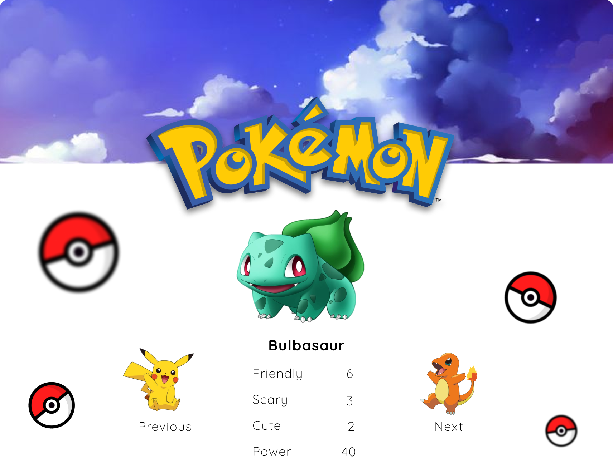

<h1 align="center">Pokémon Card Game</h1>

  <b>Become the ultimate Pokémon Trainer!</b>

## ✨ Features

- Pokémon Card Game created using html, css and vanilla javascript.
- Uses Pokémon's API to get Pokémon data.

## 📜 Credits

Everything is coded by Alex lo Storto unless otherwise noted

Licensed under the MIT License.
