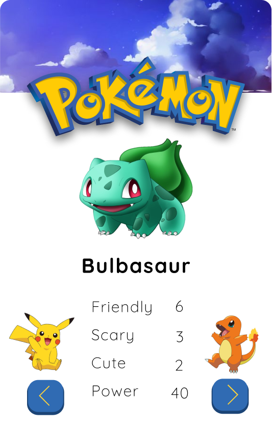

<h1 align="center">Pokémon Card Game</h1>

<p align="center">
  <b>Become the ultimate Pokémon Trainer!</b>
</p>

<p align="center"></p>


## 🏗️ Tutorial

Read article on [Medium](https://medium.com/@lostorto.business/making-a-pok%C3%A9mon-app-in-under-2-hours-f318af10f430).

## ✨ Features

- Pokémon Card Game created using html, css and vanilla javascript.
- Uses Pokémon's API to get Pokémon data.

## 📋 To-do List

- Make mobile responsive
- Remove image delay when iterating through Pokémon
- Add Pokémon types
- Find higher-quality clouds image
- Add loading animation to wait for PokeAPI
- Add error messages/pop-ups

## 🔧 Set-up
	
1) Clone (download all the code from) the GitHub repository, either using Git or downloading as a ZIP file.
2) Open the HTML file in your browser.
3) And that's it!

## 📜 Credits

```python
class Developers:
    self.working = True

    def getDevelopers(self):
        return ['alexlostorto']
```

Licensed under the MIT License.
